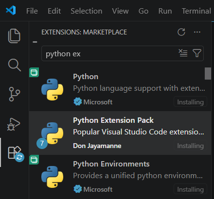
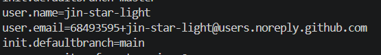

# 나만의 프롬프트 관리

자주 사용하는 프롬프트를 카테고리별로 등록하고 검색하며 즐겨찾기로 관리할 수 있는 Python 콘솔 프로그램입니다.

## 실행 환경

- Python 3.10 이상
- 별도 외부 라이브러리 없음

## 실행 방법

프로젝트 폴더에서 다음 명령을 실행합니다.

```bash
python main.py
```

Windows 터미널에서 `python` 명령을 찾지 못한다면 VSCode의 **Python: Select Interpreter**에서 Python 3.10 이상의 인터프리터를 선택한 후 실행합니다.

## 테스트 방법

Python 표준 라이브러리의 `unittest`를 사용하므로 별도 설치가 필요하지 않습니다.

```bash
python -m unittest discover -s tests -v
```

## 기능 목록

1. 프롬프트 추가
2. 전체 프롬프트 목록
3. 카테고리별 조회
4. 제목 또는 내용 키워드 검색
5. 프롬프트 상세 보기
6. 즐겨찾기 추가 및 해제
7. 즐겨찾기 목록
8. 잘못된 메뉴·카테고리·프롬프트 번호 입력 안내

각 기능을 실행한 후에는 메인 메뉴로 돌아오며, 0번을 선택하면 프로그램이 종료됩니다.

## 프롬프트 데이터

각 프롬프트는 다음 정보를 포함합니다.

- 제목 (`title`)
- 내용 (`content`)
- 카테고리 (`category`)
- 즐겨찾기 여부 (`favorite`)

프로그램 시작 시 예시 프롬프트 3개가 등록되어 있습니다. 실행 중 추가한 프롬프트와 즐겨찾기 상태는 프로그램이 종료될 때까지 유지되며, 프로그램을 다시 실행하면 기본 데이터로 초기화됩니다.

## 카테고리

- 텍스트 생성
- 이미지 생성
- 영상 생성
- 페르소나
- 자동화
- 기타
- 사용자 직접 입력 카테고리

## 프로젝트 구조

```text
.
├── main.py
├── tests/
│   └── test_main.py
├── images/
├── .gitignore
└── README.md
```

## 개발 환경 스크린샷

### Korean Language Pack


### Python Extension



### Git 설정



## 프로그램 실행 화면

### 프롬프트 추가


### 프롬프트 목록


를 표시한다.png>)

### 카테고리별 조회


### 프롬프트 검색


### 프롬프트 상세 보기


### 즐겨찾기


### 프로그램 종료


## GitHub 저장소

[https://github.com/jin-star-light/A1-1](https://github.com/jin-star-light/A1-1)
